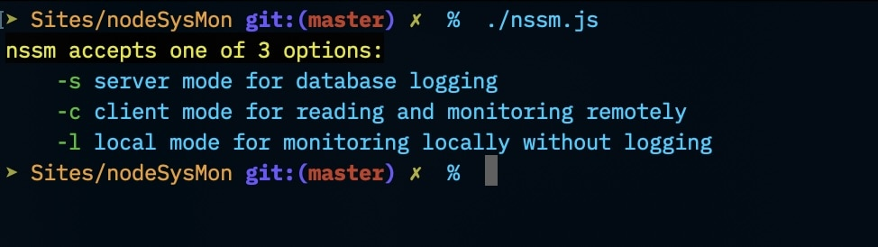
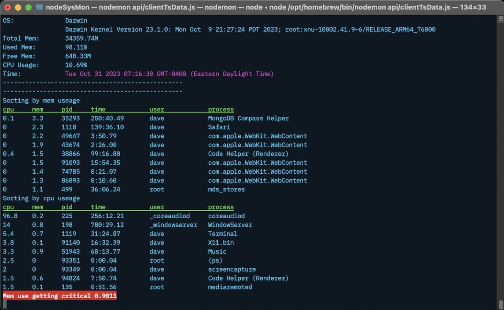

# Node Simple System Monitor


## What is this?
Right now it's a basic cli system monitor tested for MacOS and Linux (Unbuntu LTS) monitoring. 

Requires [NodeJS](https://nodejs.org/en)
also avaialbe via most pakage magagers: apt, brew, etc

There are 3 working modes
* local - just runs locally with no databasing
* client - for monitoring a remote server via Mongo database
* server - for gathering data and sending to Mongo (it will need to have a deamon setup)

## What does it actually monitor?
* Currently it's basically monitoring cpu and ram
* logging to database 
* process logging after threshold crossings 
    * cpu, ram, pid, process time, user, command  
    
Unfortunately I haven't been able to get a ps view to differentiate between all the differen node processes whithout being all the arguments and several lines a process - notably vscode remote.

### Packages
* Express
* Chalk for coloring headers, hostname, alerts
* Mongodb for database
* dotenv for Mongodb things
* inquirer for cli prompt for picking which host to monitor

I may remove the os version from the top of the monitoring (it isn't logged, but was informative when looking at scripting issues).

### Where is it goign?
1. It needs a web frontend and a mobile app to be able to chart / look at any historicals. 
2. I'd like to do some network monitoring, but have to think about how to gather that data.
3. open to suggestions - open an issue with any thoughts

### What's the timeline on things?
Unkown - my iOS dev is entry level, but a web frontend shouldn't be too far out. Nailing down the backend / cli requirements first.

## How to run
Minimally you can clone the repo, `npm i`, and then run ``./nssm.js -l`` to run local monitoring
```
npm -i
./nssm.js
```
For logging and remote monitoring you just need a mongodb
and add `.env` to the root dir and add:  
```
MONGO_URI=<paste connection string>  
MONGO_DB=<name of database you created>  
nssmCollection=<name your collection>      
```
(nssm will create the collection and add the ttl index to it)
The ttl is set to 3 days currently

Threshold options added for server:
```bash
./nssm.js -s mem=.75 cpu=.8
```

#### How does it work?
1. The metrics at the top of the screen that continuosly monitor cpu and ram is all pulled through native node api.
2. The process list is being pull through bash scripts that do a ps | head | awk that gats parsed out and formated in node. I suspect ps will be a problem on windows and may need something using taskList? instead from some reading.
3. The 2 sets of metrics are displayed seperately but combined into an object for Mong. 
