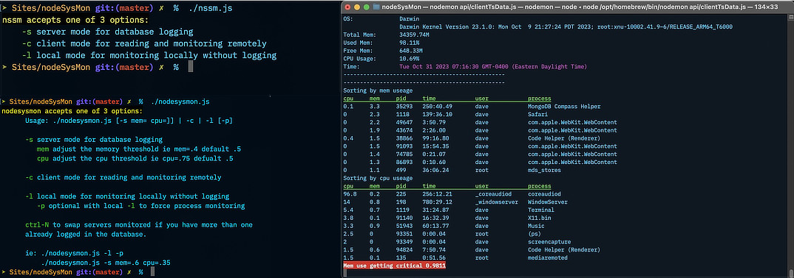
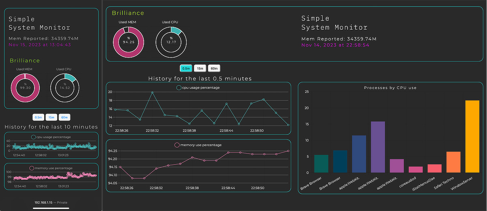

# Nodesysmon


[](https://app.codacy.com/gh/echo-dave/nodesysmon/dashboard?utm_source=gh&utm_medium=referral&utm_content=&utm_campaign=Badge_grade)

v0.6 Rename + web client - ssm and nssm were taken on npm so I've renamed to nodesysmon - this means the git url has changed so you'll need to update url for existing clones. `git@github.com:echo-dave/nodesysmon.git`



[#Installation](#installation) [#Running](#running) [#Tech](#tech)

### Simple System Monitoring

Monitoring realtime CPU, Memory, and processes list sorted by cpu or mem (top 10).

- Server mode for collecting data and sending to db
- local only mode for monitoring current system
- client cli for monitoring via database
- client web monitoring via the server

## Installation

### Requirements

- [node](https://nodejs.org/en) from your package manager of choice.
- [MongoDB](http://mongodb.com) v6+
- Mac or Linux server (untested on Windows but expect issues)

### Installation

clone repo then run

```bash
npm i
npm link
```

### Configuration

You will need to create a new file `.env` in the base folder and add some MongoDB info:

```editorconfig
MONGO_URI=<paste connection string>
MONGO_DB=<name of database you created>
nssmCollection=<name your collection>
```

Running the server should setup the collection if it doesn't already exist and add the indexes

### Running

`nodesysmon -s mem=0 cpu=0` zeroing the thresholds means it will continuously monitor and log processes vs setting a higher threshold to reduce server db io

## Tech

### Package dependencies

- Express
- Chalk for coloring headers, hostname, alerts
- Mongodb for database
- dotenv for Mongodb things
- inquirer for cli prompt for picking which host to monitor
- Sveltekit for the front end web client
- Socketio connecting server and client for realtime data

### How it works

1. The metrics at the top of the screen that continuously monitor cpu and ram is all pulled through native node api.
2. The process list is being pull through bash scripts that do a ps | head | awk that gats parsed out and formatted in node. I suspect ps will be a problem on windows and may need something using taskList? instead from some reading.
3. The 2 sets of metrics are displayed separately but combined into a single object for Mongo.
4. Mongo collection has a TTL index that expires data after 3 days (can be adjusted based on feedback).
